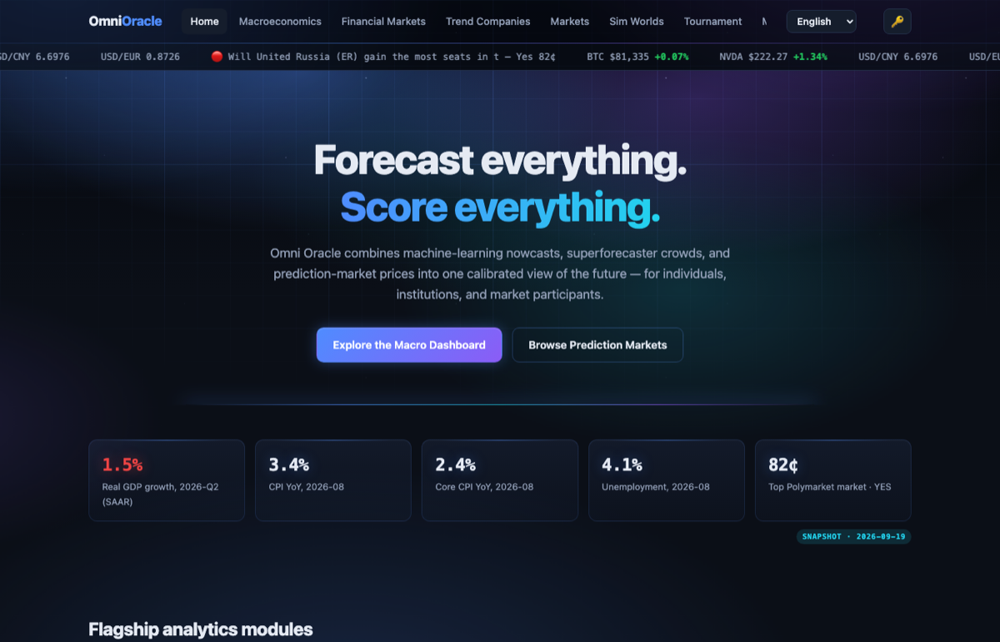

# Omni Oracle 🔮

[](https://github.com/presleyzhou/omni-oracle/actions/workflows/ci.yml)
[](https://github.com/presleyzhou/omni-oracle/actions/workflows/snapshot.yml)
[](LICENSE)

**All-in-one forecasting & prediction platform — research-grounded design prototype.**

Live site: **https://presleyzhou.github.io/omni-oracle/**



Omni Oracle combines three sources of foresight — machine-learning nowcasts, superforecaster
crowds, and prediction-market prices — into one calibrated view of the future, serving
individual users, institutional clients, and prediction-market participants. A fourth module
(M3, inspired by the open-source [MiroFish](https://github.com/666ghj/MiroFish) engine) builds
a parallel digital world from real-world seed information and lets you rehearse the future
with thousands of memory-bearing agents.

The UI is fully multilingual: **English · 中文 · Français · Español · 한국어** (switcher in the
top-right corner; the choice persists across pages and visits).

## Pages

| Page | Module | What it shows |
|---|---|---|
| [index.html](index.html) | — | Platform overview, official-data hero stats, live market ticker |
| [macro.html](macro.html) | M1 | BEA GDP, BLS CPI / core / unemployment, **financial-crisis early-warning composite** (yield curve, NY Fed probit, Sahm rule, VIX), World Bank actuals, AI macro analyst |
| [finance.html](finance.html) | M1 | Live FX (ECB via Frankfurter), US Treasury rates, tech mega-cap quotes, Fed decision tree |
| [trends.html](trends.html) | M2 | Emerging-theme explorer and company scorecards with live quotes and ML decile ranks |
| [markets.html](markets.html) | P1–P8 | Prediction markets across 8 categories with a working Hanson LMSR trade simulator, live Polymarket odds, BYOK AI trader |
| [market.html](market.html) | P | Single-market detail: 90-day history, order-book depth, in-page trading |
| [simworld.html](simworld.html) | M3 | Parallel-world simulation: seed upload, entity graph, agent society, god-view interventions, Monte Carlo, exportable report, agent chat |
| [tournament.html](tournament.html) | C1/C3 | Brier-scored leaderboard, calibration curves, AI forecaster bench, My Forecasts |
| [methodology.html](methodology.html) | — | Academic foundation, market-infrastructure design, data sources, roadmap |

## How the data layer works

Everything runs in the browser — there is no backend. Three tiers keep the site honest and
resilient, and every card shows which one it is on (badge in the heading):

| Badge | Meaning |
|---|---|
| 🟢 **Live** | Fetched from the public API just now (cached in `sessionStorage` for a few minutes to respect rate limits) |
| 🟠 **Cached** | The API is unreachable; showing the last copy this browser fetched |
| 🔵 **Snapshot** | From [`data/live.json`](data/live.json), refreshed daily by the [snapshot workflow](.github/workflows/snapshot.yml) |
| ⚪ **Demo data** | Illustrative mock numbers from [`js/data.js`](js/data.js) — never a live feed |

Policy: slow-moving official statistics (BEA, BLS, World Bank) are read **snapshot-first** — the
BLS v1 API allows only 25 unregistered calls per IP per day, so browsers must not hit it on every
page load. Prices (stocks, crypto, FX, Polymarket) are **live-first** with the snapshot as
fallback. The shared helpers live in [`js/app.js`](js/app.js) (`OO_FETCH`, `OO_SNAPSHOT`,
`ooLive`, `ooSnap`, `ooMarkSource`).

The macro page's **financial-crisis early-warning** card (yield-curve slope and the NY Fed probit
recession probability, Sahm rule, VIX, growth and core-inflation backdrop) is built entirely from
these inputs; the optional Baa − 10Y credit-spread row appears once a free
[FRED API key](https://fred.stlouisfed.org/docs/api/api_key.html) is stored as the repository
secret `FRED_API_KEY` (read only by the snapshot workflow, never shipped to browsers).

Upstream sources: [DBnomics](https://db.nomics.world/) (BEA), [BLS](https://www.bls.gov/developers/),
[World Bank](https://datahelpdesk.worldbank.org/knowledgebase/articles/889392),
[Frankfurter](https://frankfurter.dev/) (ECB), [FiscalData](https://fiscaldata.treasury.gov/api-documentation/),
[stockanalysis.com](https://stockanalysis.com/), [CoinGecko](https://www.coingecko.com/en/api),
[Polymarket Gamma](https://docs.polymarket.com/), [US Treasury par yield curve](https://home.treasury.gov/resource-center/data-chart-center/interest-rates/TextView?type=daily_treasury_yield_curve),
[CBOE VIX history](https://www.cboe.com/tradable_products/vix/vix_historical_data/), optional [FRED](https://fred.stlouisfed.org/series/BAA10Y).

### Question ledger (contamination-safe AI scoring)

[`data/questions.json`](data/questions.json) is appended daily by the snapshot workflow with newly
created, liquid, non-sports Polymarket markets and refreshed until they resolve. The tournament
page's AI bench only asks a model about questions created after the knowledge cutoff you declare
in the 🔑 dialog, stores each forecast with the market price at commit time, and grades it against
the resolution — model Brier vs. market Brier at the same moment.

## Bring your own LLM key

The 🔑 button in the nav opens one shared settings dialog for every AI feature (macro/equity
analysts, AI trader, AI forecaster bench, ReportAgent, agent chat). Keys are stored only in your
browser's `localStorage` and calls go straight from the browser to the provider. Defaults are in
`OO_MODELS` in [`js/app.js`](js/app.js):

| Provider | Default model | Endpoint |
|---|---|---|
| Anthropic | `claude-sonnet-5` | `https://api.anthropic.com` |
| OpenAI-compatible | `gpt-4o-mini` | `https://api.openai.com/v1` (override the base URL for any compatible server) |

Optional fields in the same dialog: **ensemble** (extra model ids of the same provider — they answer
independently and are combined by confidence-weighted voting; markets where they disagree by >25pp
are flagged and not traded) and **knowledge cutoff** (required for the contamination-safe AI bench).

## Repository layout

```
index.html …           one HTML file per page (static markup + <script src> only)
js/app.js              shared helpers: fetch/snapshot layer, LLM client, 🔑 dialog, LMSR
js/data.js             mock data (Fed tree, themes, companies, demo markets, leaderboard)
js/i18n.js             i18n engine + inline English dictionary
i18n/{zh,fr,es,ko}.json other languages, lazy-loaded and cached per asset version
js/pages/<page>.js     page logic (one file per page)
data/live.json         daily API snapshot (committed by GitHub Actions)
scripts/snapshot.mjs   builds data/live.json
scripts/check-i18n.mjs CI: dictionaries complete & every referenced key exists
scripts/bump.sh        bumps ?v= cache-busters and the service-worker cache name
scripts/create-issues.sh  turns the RESEARCH-UPDATES roadmap into GitHub issues
sw.js                  network-first service worker (offline shell)
```

Pages ship a strict `Content-Security-Policy` (`script-src 'self' https://cdn.jsdelivr.net`) —
no inline scripts, which matters because BYOK keys live in `localStorage`.

## Running locally

Pure static site — no build step:

```bash
python3 -m http.server 8000
# open http://localhost:8000
```

Useful commands:

```bash
node scripts/snapshot.mjs      # refresh data/live.json from every upstream API
node scripts/check-i18n.mjs    # verify translations
scripts/bump.sh                # after changing css/js: bump ?v= and the SW cache name
npx html-validate "*.html"     # markup check (same as CI)
```

## Design document

The full research-grounded design (with the complete academic reading list) is in
[DESIGN.md](DESIGN.md): theoretical foundations from forecasting science (Tetlock, Satopää,
Timmermann, Gneiting), prediction markets (Wolfers–Zitzewitz, Hanson LMSR, Polymarket
CLOB/oracle architecture), macro nowcasting (Giannone–Reichlin–Small DFM, ML horseraces),
and asset pricing / innovation (Gu–Kelly–Xiu, Kogan et al.). The 2025–26 literature review and
prioritized roadmap are in [RESEARCH-UPDATES.md](RESEARCH-UPDATES.md); each roadmap item is
tracked as a GitHub issue labelled `roadmap`.

## Disclaimer

This is a design prototype. Prices, forecasts, scores and markets marked **Demo data** are
illustrative mock numbers (authored 2026-07, question set refreshed 2026-09). Nothing here is
investment advice; play-money only.

## License

[MIT](LICENSE) © 2026 Presley Zhou
